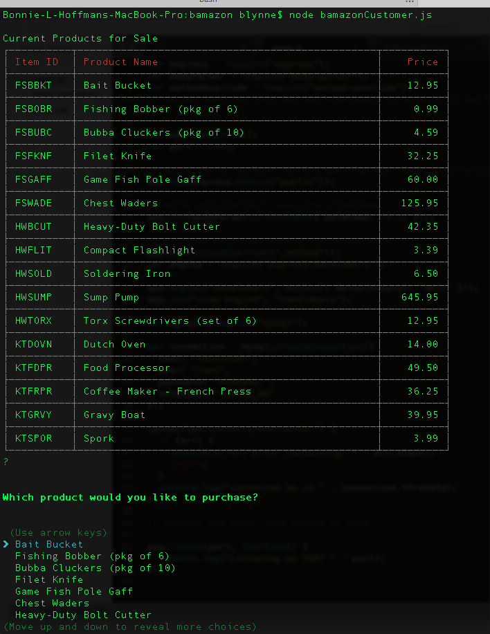
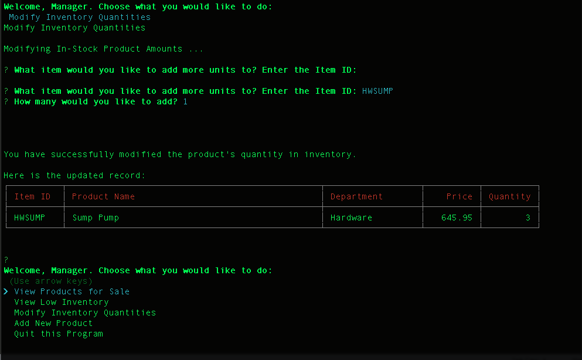

# BAMazon

## Overview

This exercise showcases the creation a CLI application that successfully displays and modifies records in a **MySQL** database exclusively within a **Node.js** environment. The basic application requirements were to create an Amazon-like storefront that can take in orders from customers and as a result of a purchase, decrease the corresponding item's stock amount in the inventory. Additionally, both manager and supervisor interfaces allow the user to further manipulate the database tables to modify inventory products and amounts and view sales by departments using SUM and GROUP BY statements within specific queries.

Due to this being a command line application exclusively, there was the added challenge of providing user-friendly prompts as well as intuitive feedback and sufficient spacing for improved readibility. A personally added feature that was built into all three scripts was to provide a option to exit the node environment using `process.kill(process.pid);`. This was seemlessly integrated as the final option of each inquirer list.

NPMs utilized in this exercise were `mysql`, `inquirer`, `os`, and in order to display resulting database tables and records to the console in a tabular fashion, the Node package, `cli-table` was also implemented. 

- - - 

### Customer View - bamazonCustomer.js

#### Database initialization

Initially, a MySQL Database called `bamazon` containing a table named `products` was created using a custom query. 

This table contains the following columns:

   * _item_id_ (a unique, auto-incremented id for each product)

   * _product_name_ (name of each product)

   * _department_name_ (which store department the product is associated with)

   * price (cost of product to customer)

   * stock_quantity (how much of the product is currently available in store)

This database was initially populated with 10 different products using a 'seed' query file.

**Application Specifics:**

A Node application called `bamazonCustomer.js` was created to handle the basic requirements demanded of the customer interface. Running this application first displays all of the items available for sale:

 

The app then prompts the user to choose the name of the product they would like to purchase and then how many units of that product they desire.

Once the customer has placed the order, the application references the `products` table in the MySQL database through a query to confirm that the store has enough of the product to meet the customer's request.

If there are not sufficient quantities to fulfill an order, the app returns a customer-friendly note to that effect. It also thanks the customer for their interest in that item and encourages the user to return again soon to see if the stock has been replenished. Following this specific feedback, a new prompt queries the visitor if they would like to place another order or to exit the program completely:

If the store's quantity of the desired product *is* sufficient to fulfill a customer's order, another dialog is returned expressing such. Once the order has been submitted, the product's record in the database is updated to reflect the remaining quantity and displays the total cost of the purchase based on the price and quantity requested:

- - - 

### Manager View - bamazonManager.js

**Specifics:**

Alternately, a Node application called `bamazonManager.js` was created to handle the basic requirements for a management interface. Running this application first displays all of the administrative functions available to a store manager:

Selecting `View Products for Sale` will list every available product in a simple, clean table based on columns containing item IDs, names, prices, and quantities:

Selecting `View Low Inventory` will display all items with an inventory count lower than five; again, in tabular format:

By selecting `Add to Inventory`, the app returns a prompt that allows a manager to increase the quantity of any item currently in the store:

Lastly, when a manager selects `Add New Product`, the app will permit the administative user to follow the prompts to enter a brand new item into the store, complete with initial price and quantity:

*(store department list draws dynamically from the database using a custom query fed into the inquirer list)*

- - -

### Supervisor View - bamazonSupervisor.js

**Specifics:**

Lastly, a Node application called `bamazonSupervisor.js` was created to handle necessary tasks for a supervisor's interface. Running this application first displays the two administrative functions available to a store supervisor:

A new MySQL table called `departments` was created, including the following columns:

   * _department_id_

   * _department_name_

   * _over_head_costs_ (a monetary amount arbitrarily set for each department)

The `products` table was modified to now include a `product_sales` column and the original `bamazonCustomer.js` app was revisited to ensure that this value is updated with each individual product's total revenue from each sale.

==================
Additionally, the initial `bamazonCustomer.js` app was also modified so that when a customer purchases anything from the store, the price of the product multiplied by the quantity purchased is added to the product's `product_sales` column.

   * Make sure your app still updates the inventory listed in the `products` column.

When a supervisor selects `View Product Sales by Department`, the app displays a summarized table in the terminal/bash window. 

   * Hint: You may need to look into GROUP BYs.

   * Hint: You may need to look into JOINS.

===================

A value for total profit of each department is displayed in a `total_profit` column and is calculated on the fly using the difference between `over_head_costs` and `product_sales`. 
*Total Profit is generated dynamically and is not stored in the database*:

- - - 

.png)

- - - 

(c)2017 __Bonnie Lynne Hoffman__ *toward the completion of The University of Texas at Austin Houston Coding Boot Camp Certificate - (June 2017 cohort)*

